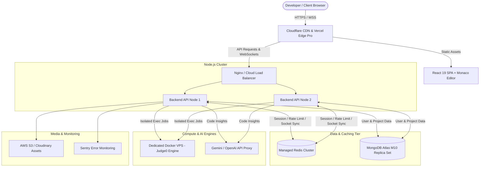

# 💰 CodeSphere - Growth Phase Detailed Cost, Infrastructure & Procurement Playbook
> **Phase Target**: 1,000 – 25,000 Active Users  
> **Monthly Budget**: **₹21,250 – ₹55,250 / month** ($250 – $650 USD)  
> **Annual Budget**: **₹2,55,000 – ₹6,63,000 / year** ($3,000 – $7,800 USD)  
> **Currency Exchange Reference**: 1 USD = ₹85.00 INR  

---

## 📌 Executive Summary

To scale **CodeSphere** from an MVP into a commercially viable, production-grade cloud IDE and developer platform supporting **1,000 to 25,000 Monthly Active Users (MAU)** with concurrent real-time collaboration, an optimized infrastructure plan is essential.

At this stage, system reliability, sub-second code compilation, real-time WebSocket state synchronization, and protection against untrusted code execution are non-negotiable.

This document outlines:
1. **Itemized Costs & Specs** for the Growth Phase.
2. **Technical Rationale (How & Why)** for each infrastructure component.
3. **Step-by-Step Procurement & Setup Guide** on how to buy, configure, and connect every service to CodeSphere.

---

## 🏗️ Growth Phase Architecture Overview



---

## 📊 Summary Cost Table (Growth Phase: 1,000 – 25,000 Users)

| Service Component | Infrastructure Spec / Provider | Monthly Cost (USD) | Monthly Cost (INR ₹) | Annual Cost (INR ₹) | % of Budget |
| :--- | :--- | :--- | :--- | :--- | :--- |
| **1. Code Execution VPS (Judge0)** | 4 vCPU, 8GB–16GB RAM Docker VPS (Hetzner / DO) | $25 – $150 | **₹2,125 – ₹12,750** | ₹25,500 – ₹1,53,000 | **23%** |
| **2. Database (MongoDB Atlas)** | M10 / M20 Managed Replica Set (10GB–20GB storage) | $57 – $150 | **₹4,845 – ₹12,750** | ₹58,140 – ₹1,53,000 | **23%** |
| **3. Backend API Servers** | 2–4 Node.js Instances (2 vCPU, 4GB RAM each) | $100 – $300 | **₹8,500 – ₹25,500** | ₹1,02,000 – ₹3,06,000 | **40%** |
| **4. Redis Cache & Socket Sync** | Managed Redis 1GB–2.5GB (Upstash / Redis Cloud) | $30 – $80 | **₹2,550 – ₹6,800** | ₹30,600 – ₹81,600 | **12%** |
| **5. AI Assistant Tokens** | Gemini 1.5 Flash / OpenAI API (Prompt Cached) | $100 – $400 | **₹8,500 – ₹34,000** | ₹1,02,000 – ₹4,08,000 | **35%** |
| **6. Frontend CDN Hosting** | Vercel Pro / Cloudflare Pro | $20 | **₹1,700** | ₹20,400 | **3%** |
| **7. Media & Storage** | AWS S3 + CloudFront / Cloudinary Plus | $50 – $150 | **₹4,250 – ₹12,750** | ₹51,000 – ₹1,53,000 | **15%** |
| **8. Email & APM Monitoring** | AWS SES + Sentry Team Plan | $31 – $41 | **₹2,635 – ₹3,485** | ₹31,620 – ₹41,820 | **5%** |
| **9. Domain & Security** | `.com`/`.io` Domain + Cloudflare WAF/SSL | $1 – $3.50 | **₹85 – ₹280** | ₹1,000 – ₹3,400 | **< 1%** |
| **TOTAL ESTIMATED BUDGET** | **Combined Growth Phase Fleet** | **$250 – $650** | **₹21,250 – ₹55,250** | **₹2,55,000 – ₹6,63,000** | **100%** |

---

## 🔍 Step-by-Step Procurement & Setup Guide for Each Service

Below is the complete walkthrough detailing **How to Buy**, **Exact Setup Steps**, **Why It Is Important**, and **What It Does** for every service in the Growth Phase table.

---

### 1. Dedicated VPS for Code Sandboxing & Compilation (Judge0)
> **Cost**: **₹2,125 – ₹12,750 / month** ($25 – $150 USD)  
> **Provider**: Hetzner Cloud (CPX31 / CCX22) or DigitalOcean CPU-Optimized Droplet  

#### 🛒 How to Buy:
1. Visit **Hetzner Cloud** (`hetzner.com/cloud`) or **DigitalOcean** (`digitalocean.com`).
2. Create an account and add a payment method (Credit Card / PayPal).
3. Click **Create Server / Droplet**:
   - **Type**: CPU-Optimized Cloud Server (4 vCPU AMD EPYC, 8GB to 16GB RAM, 160GB NVMe storage).
   - **Location**: Select the region closest to your main user base (e.g. EU / US / Singapore).
   - **OS Image**: Ubuntu 22.04 LTS 64-bit.
4. Add your SSH Public Key for secure authentication.

#### ⚙️ Step-by-Step Setup Actions:
1. **Connect via SSH**:
   ```bash
   ssh root@<YOUR_VPS_PUBLIC_IP>
   ```
2. **Install Docker & Docker Compose**:
   ```bash
   apt update && apt upgrade -y
   apt install -y docker.io docker-compose git
   systemctl enable --now docker
   ```
3. **Clone and Configure Judge0**:
   ```bash
   git clone https://github.com/judge0/judge0.git
   cd judge0
   ```
4. **Edit Config (`judge0.conf`)**:
   Set a strong `REDIS_PASSWORD` and secret auth keys. Ensure `CPU_TIME_LIMIT=5` and `MEMORY_LIMIT=128000` (128MB).
5. **Launch Docker Services**:
   ```bash
   docker-compose up -d
   ```
6. **Connect to CodeSphere**:
   Add the server IP to `server/.env`:
   ```env
   JUDGE0_API_URL=http://<YOUR_VPS_PUBLIC_IP>:2358
   JUDGE0_API_KEY=your_configured_auth_key
   ```

#### ❓ Why Important & What It Does:
* **What It Does**: Listens for HTTP execution requests from the CodeSphere API, spins up short-lived isolated Docker containers for 9+ languages (Python, C++, Java, JS, Go, Rust), executes the user code, captures `stdout`/`stderr`, and returns execution time/memory.
* **Why Essential**: Using a pay-per-call API for 25,000 users running 150k scripts/month would cost **₹65,000+/mo**. Hosting your own VPS converts variable costs into a **predictable flat fee of ₹2,125 to ₹12,750/mo** while isolating dangerous user code away from your primary web server.

---

### 2. Managed Database Cluster (MongoDB Atlas M10 / M20)
> **Cost**: **₹4,845 – ₹12,750 / month** ($57 – $150 USD)  
> **Provider**: MongoDB Atlas Cloud (`mongodb.com/cloud/atlas`)  

#### 🛒 How to Buy:
1. Sign up / Log in to MongoDB Atlas.
2. Click **Create a Database** $\rightarrow$ Select **Dedicated M10** (10GB storage, 2GB RAM) or **M20** (20GB storage, 4GB RAM).
3. Select Cloud Provider (AWS/GCP) and Region (e.g. `ap-south-1` Mumbai or `us-east-1` N. Virginia).
4. Enter payment billing info (~$57/mo).

#### ⚙️ Step-by-Step Setup Actions:
1. **Network Access Control**:
   Go to **Security** $\rightarrow$ **Network Access** $\rightarrow$ Click **Add IP Address**. Add the static IP addresses of your backend API servers (or restrict access via IAM/VPC peering).
2. **Database Authentication**:
   Go to **Database Access** $\rightarrow$ **Add New Database User**.
   - Username: `codesphere_prod`
   - Password: Generate a secure 32-character password.
   - Privilege: `Read and write to any database`.
3. **Get Connection String**:
   Click **Connect** $\rightarrow$ **Drivers (Node.js)**. Copy URI:
   ```env
   MONGO_URI=mongodb+srv://codesphere_prod:<PASSWORD>@codesphere-cluster.mongodb.net/codesphere_prod?retryWrites=true&w=majority
   ```
4. **Deploy Indexes**:
   After starting the server, run index builder once:
   ```bash
   node server/config/indexes.js
   ```

#### ❓ Why Important & What It Does:
* **What It Does**: Provides a 3-node Replica Set (Primary + 2 Secondaries) that stores user credentials, code projects, file metadata, event logs, and settings.
* **Why Essential**: Shared free tiers choke on IOPS limits when hundreds of developers query simultaneously. Atlas M10 handles 40+ indexes (configured in [`indexes.js`](file:///d:/PROJECTS/Codesphere/server/config/indexes.js)), auto-scales disk capacity, and provides 99.99% uptime with automated hourly backups.

---

### 3. Backend API Servers (Render / DigitalOcean App Platform)
> **Cost**: **₹8,500 – ₹25,500 / month** ($100 – $300 USD)  
> **Provider**: Render Team Plan (`render.com`) or DigitalOcean App Platform  

#### 🛒 How to Buy:
1. Sign up on **Render** or **DigitalOcean**.
2. Connect your GitHub organization/account.
3. Click **New Web Service** $\rightarrow$ Select repository `Codesphere`.
4. Select Plan: **Standard Instance (2 vCPU, 4GB RAM)** @ $25/mo per instance. Scale to 2–4 instances ($50 – $100/mo base).

#### ⚙️ Step-by-Step Setup Actions:
1. **Build & Start Settings**:
   - Root Directory: `server`
   - Build Command: `npm install`
   - Start Command: `npm start` (`node server.js`)
2. **Environment Variables**:
   Add environment variables in dashboard:
   - `MONGO_URI`, `REDIS_URL`, `JWT_SECRET`, `JUDGE0_API_URL`, `CLIENT_URL`, `ALLOWED_ORIGINS`, `NODE_ENV=production`.
3. **Health Checks**:
   Set Health Check Path to `/health`.
4. **Auto-Deploy**: Enable automatic deploys on push to `main` branch.

#### ❓ Why Important & What It Does:
* **What It Does**: Executes the Node.js / Express 5 server, handles REST endpoints, manages JWT/OAuth authentication, streams resources, and maintains persistent WebSocket (`socket.io`) connections.
* **Why Essential**: WebSocket connections stay open continuously for live collaboration. Load-balancing across multiple instances guarantees zero-downtime rolling deploys and prevents server crashes when user traffic spikes.

---

### 4. Distributed Cache & Socket Sync (Upstash / Redis Cloud)
> **Cost**: **₹2,550 – ₹6,800 / month** ($30 – $80 USD)  
> **Provider**: Upstash Redis (`upstash.com`) or Redis Labs Cloud  

#### 🛒 How to Buy:
1. Sign up at **Upstash** or **Redis Labs Cloud**.
2. Click **Create Database**:
   - Name: `codesphere-redis-growth`
   - Primary Region: Same region as your API server.
   - Capacity: Fixed 1GB to 2.5GB RAM instance with eviction strategy `volatile-lru`.

#### ⚙️ Step-by-Step Setup Actions:
1. Copy Connection String:
   ```env
   REDIS_URL=rediss://default:<PASSWORD>@<YOUR_REDIS_ENDPOINT>:6379
   ```
2. Paste into `server/.env`.
3. Verify that `rate-limit-redis` (in [`rateLimit.middleware.js`](file:///d:/PROJECTS/Codesphere/server/middlewares/rateLimit.middleware.js)) and `socket.io-redis-adapter` connect successfully.

#### ❓ Why Important & What It Does:
* **What It Does**: Serves as a high-speed shared memory storage for API rate limits, user session tokens, GET response caching, and Socket.io multi-server event broadcasting.
* **Why Essential**: If User A is connected to Backend Instance 1 and User B is on Backend Instance 2, Redis Pub/Sub bridges their WebSocket messages so they can code together in real time without lag.

---

### 5. AI Assistant API Allocation (Gemini / OpenAI API)
> **Cost**: **₹8,500 – ₹34,000 / month** ($100 – $400 USD)  
> **Provider**: Google AI Studio (Gemini API) or OpenAI Platform  

#### 🛒 How to Buy:
1. Log in to **Google AI Studio** (`aistudio.google.com`) or **OpenAI Platform** (`platform.openai.com`).
2. Go to **Billing & Subscriptions** $\rightarrow$ Add Credit Card.
3. Set **Hard Spend Limit**: Set soft limit at **$200** and hard limit at **$400/month** to prevent unexpected billing.
4. Click **Create API Key**.

#### ⚙️ Step-by-Step Setup Actions:
1. Copy your API Key.
2. Add to `server/.env`:
   ```env
   GEMINI_API_KEY=AIzaSy...
   ```
3. Ensure backend controller limits context payload (max 1,000 output tokens per code explanation).

#### ❓ Why Important & What It Does:
* **What It Does**: Powers CodeSphere's smart AI feature set—generating code suggestions, explaining compilation errors, refactoring code snippets, and acting as an intelligent developer co-pilot.
* **Why Essential**: AI features increase developer retention and justify paid subscription plans. Setting hard billing limits ensures AI consumption never exceeds your monthly target budget.

---

### 6. Cloud Media & Resource Storage (AWS S3 / Cloudinary Plus)
> **Cost**: **₹4,250 – ₹12,750 / month** ($50 – $150 USD)  
> **Provider**: AWS S3 + CloudFront (`aws.amazon.com/s3`) or Cloudinary  

#### 🛒 How to Buy:
1. Create an **AWS Account** $\rightarrow$ Go to **S3 Console**.
2. Click **Create Bucket**:
   - Bucket Name: `codesphere-production-assets`
   - Region: `ap-south-1` or `us-east-1`.
   - Block all public access: Select Enabled (use signed URLs for secure downloads).

#### ⚙️ Step-by-Step Setup Actions:
1. **Create IAM Access User**:
   Go to IAM $\rightarrow$ Create User `codesphere-s3-uploader`. Attach policy `AmazonS3FullAccess` (or custom restricted S3 bucket policy).
2. **Generate Credentials**: Create Access Key & Secret Key.
3. **Configure Environment**:
   ```env
   AWS_ACCESS_KEY_ID=AKIA...
   AWS_SECRET_ACCESS_KEY=wJalrXUtnFEMI...
   AWS_S3_BUCKET_NAME=codesphere-production-assets
   AWS_REGION=ap-south-1
   ```

#### ❓ Why Important & What It Does:
* **What It Does**: Stores avatars, PDF notes (as handled in [`resource.controller.js`](file:///d:/PROJECTS/Codesphere/server/controllers/resource.controller.js#L108-L123)), code zip archives, and project attachments off server disks.
* **Why Essential**: Serving files directly from API server disks quickly exhausts server disk space and consumes RAM. S3 provides 99.999999999% durability and fast global downloads.

---

### 7. Frontend CDN Hosting & Global Delivery (Vercel Pro)
> **Cost**: **₹1,700 / month** ($20 USD)  
> **Provider**: Vercel Pro (`vercel.com`)  

#### 🛒 How to Buy:
1. Sign up at **Vercel** $\rightarrow$ Connect GitHub.
2. Upgrade Team Account to **Pro Plan** ($20/seat/month).

#### ⚙️ Step-by-Step Setup Actions:
1. Click **Import Project** $\rightarrow$ Choose `Codesphere` repo.
2. Select Root Directory: `client`.
3. Framework Preset: **Vite**.
4. Build Command: `npm run build`, Output Directory: `dist`.
5. Environment Variables:
   ```env
   VITE_API_BASE_URL=https://api.codesphere.com/api
   VITE_SOCKET_URL=https://api.codesphere.com
   ```
6. Click **Deploy**.

#### ❓ Why Important & What It Does:
* **What It Does**: Serves the compiled React 19 single-page application, Tailwind CSS assets, Three.js 3D Globe, and Monaco Code Editor bundle from 300+ global edge locations.
* **Why Essential**: Guarantees that developers experience sub-1-second page loads worldwide.

---

### 8. Transactional Email & System Error Monitoring
> **Cost**: **₹2,635 – ₹3,485 / month** ($31 – $41 USD)  
> **Provider**: Sentry Team Plan ($26/mo) + AWS SES ($5–$15/mo)  

#### 🛒 How to Buy:
1. Sentry: Visit `sentry.io` $\rightarrow$ Create Team Account ($26/mo) $\rightarrow$ Create Node.js and React projects.
2. AWS SES: Open AWS Console $\rightarrow$ Search **Simple Email Service (SES)**.

#### ⚙️ Step-by-Step Setup Actions:
1. **Sentry Integration**: Copy your DSN and set in `server/.env`:
   ```env
   SENTRY_DSN=https://<KEY>@o0.ingest.sentry.io/<PROJECT_ID>
   ```
   (Integrates with [`monitoring.js`](file:///d:/PROJECTS/Codesphere/server/config/monitoring.js)).
2. **AWS SES Domain Verification**:
   Add DKIM, SPF, and MX records to your domain DNS. Request Production Access to remove SES sandbox limits.

#### ❓ Why Important & What It Does:
* **What It Does**: Sentry captures real-time React UI crashes and Node.js exceptions before users report them. AWS SES delivers OTPs, password reset emails, and payment receipts directly to user inboxes.
* **Why Essential**: Keeps transactional emails out of spam folders and ensures zero silent runtime crashes in production.

---

### 9. Custom Domain & Cloudflare Security (Cloudflare)
> **Cost**: **₹85 – ₹280 / month** (~₹1,000 – ₹3,400 / year)  
> **Provider**: Namecheap / Cloudflare Registrar + Cloudflare DNS  

#### 🛒 How to Buy:
1. Register domain `codesphere.dev` or `codesphere.com` on Namecheap / Cloudflare Registrar (~$12 - $35/year).
2. Create a free account on **Cloudflare** (`cloudflare.com`).

#### ⚙️ Step-by-Step Setup Actions:
1. Add domain to Cloudflare $\rightarrow$ Change domain Nameservers at registrar to Cloudflare's assigned nameservers.
2. **DNS Records**:
   - `A` Record `@` $\rightarrow$ Points to Vercel/Cloudflare Pages.
   - `CNAME` Record `api` $\rightarrow$ Points to Render/App Platform backend host.
3. **Security Settings**:
   - Set SSL/TLS Encryption mode to **Full (Strict)**.
   - Turn ON **Always Use HTTPS**, **DNSSEC**, and **Brotli Compression**.

#### ❓ Why Important & What It Does:
* **What It Does**: Manages global DNS resolution, provides SSL/TLS certificates, caches static assets, and inspects HTTP traffic.
* **Why Essential**: Blocks volumetric DDoS attacks, HTTP flood bots, and unauthorized port scanners before they ever hit your origin backend servers.

---

## 📈 Budget Optimization & Financial Safety Rules

To ensure your monthly spend stays firmly inside the **₹21,250 – ₹55,250** window:

1. 🎯 **Enforce Hard Limits on Judge0 VPS**: Set Docker memory limit to `128MB` and execution timeout to `5s` per execution task (already enforced in [`judge0.service.js`](file:///d:/PROJECTS/Codesphere/server/services/judge0.service.js#L17-L18)).
2. ⚡ **Cache Common AI Requests**: Cache common syntax error explanations in Redis to avoid re-querying Gemini/OpenAI for identical code mistakes.
3. 🔒 **Set Up Billing Alerts**: Enable AWS, MongoDB Atlas, and Vercel spending thresholds at **₹35,000** and **₹50,000** to receive immediate SMS/email alerts before overages occur.

---

## 🎯 Final Summary

The **Growth Phase (1,000 – 25,000 Users)** transitions CodeSphere from an experimental prototype into a **robust, scalable, commercial SaaS platform**. Spending **₹21,250 to ₹55,250 per month** delivers enterprise-level speed, isolated multi-language code compilation, 99.99% database uptime, and AI capabilities while maintaining high profit margins on paid developer subscriptions.
