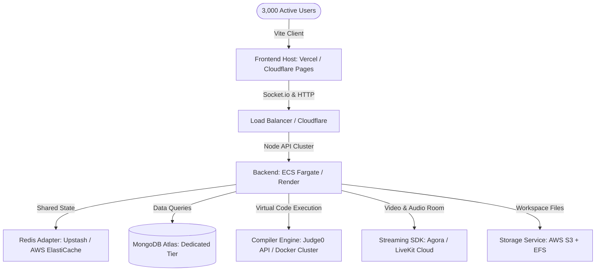

# 📊 CodeSphere: Production-Ready Cost Estimation

This document provides a comprehensive, easy-to-understand breakdown of the operational costs and third-party tools required to run the **CodeSphere** platform as a production-ready application for **3,000 active users**. 

It details the requirements for frontend hosting, backend server scaling, database capacity, real-time sync systems, file storage, code compilers, and live streaming APIs.

---

## 🗂️ Table of Contents
1. [Executive Summary](#-executive-summary)
2. [Current Architecture vs. Production Requirements](#-current-architecture-vs-production-requirements)
3. [Core Infrastructure Hosting Costs](#-core-infrastructure-hosting-costs)
4. [Feature-Specific Cost Drivers](#-feature-specific-cost-drivers)
5. [Required External API Keys & Integrations](#-required-external-api-keys--integrations)
6. [Summary Cost Table (Minimum vs. Maximum)](#-summary-cost-table-minimum-vs-maximum)
7. [Recommended Cost Optimization Strategies](#-recommended-cost-optimization-strategies)

---

## 💡 Executive Summary
* **Target Audience Capacity:** 3,000 active users (students, instructors, and administrators).
* **Estimated Monthly Operational Cost:**
  * **Minimum (Optimized & Self-Hosted):** **~$227.00 / month** (Ideal for bootstrap phase)
  * **Maximum (Fully Managed & Enterprise Grade):** **~$985.00 / month** (Ideal for high availability and low maintenance)
* **API Dependencies:** Stripe (Payments), Agora/LiveKit (Live Video), Judge0/Self-Hosted Sandbox (Compilers), AWS SES/Resend (Emails), MongoDB Atlas (Database).

---

## 🏗️ Current Architecture vs. Production Requirements

The current codebase is built on the **MERN (MongoDB, Express, React, Node.js)** stack with **Socket.io** for real-time collaboration. However, several modules must transition from local development mocks to production-ready cloud services to support 3,000 concurrent users.

### Critical Architectural Changes Needed:
1. **Workspace File Management ([workspace.service.js](file:///d:/PROJECTS/Codesphere/server/services/workspace.service.js)):**
   * *Currently:* Saves files to the local disk of the running Node process in `uploads/workspaces`. In production containers (like AWS ECS or Render), local disks are ephemeral (wiped out on restarts) and cannot be shared across multiple servers.
   * *Production Fix:* Use **AWS EFS (Elastic File System)** for shared server-level access or store workspaces as ZIP archives in **AWS S3**.
2. **Interactive Coding Sandbox ([sandbox.service.js](file:///d:/PROJECTS/Codesphere/server/services/sandbox.service.js)):**
   * *Currently:* The compiling feature is simulated client-side via a mock `setTimeout` (see [SandboxProject.jsx:L252-270](file:///d:/PROJECTS/Codesphere/client/src/features/sandbox/pages/SandboxProject.jsx#L252-L270)).
   * *Production Fix:* Implement an actual sandbox runtime API such as **Judge0 Cloud** or self-host a secure Docker compile sandbox.
3. **Live Lecture Streaming ([liveSession.service.js](file:///d:/PROJECTS/Codesphere/server/services/liveSession.service.js)):**
   * *Currently:* Manages scheduling and metadata, but has no actual WebRTC video streaming.
   * *Production Fix:* Integrate **Agora.io** or **LiveKit Cloud** for low-latency live classrooms.

---

## 🖥️ Core Infrastructure Hosting Costs

These are the foundational servers and databases needed to keep the platform online and responsive.

### 1. Frontend Hosting (React / Vite)
Handles the static delivery of the user interface (pages, styles, layouts, UI components).
* **Tools:** Cloudflare Pages, Vercel, or AWS Amplify.
* **Cost Factor:** Bandwidth consumption from assets loading.
* **Estimate:**
  * **Min:** **$0.00** (Cloudflare Pages free tier supports unlimited bandwidth and users).
  * **Max:** **$20.00 / month** (Vercel Pro for team roles and faster builds).

### 2. Backend API & WebSockets Hosting (Express / Node.js)
Houses the API routes and manages Socket.io WebSockets for chat, notifications, and collaborate-IDE updates.
* **Tools:** Render (PaaS), Railway, or AWS ECS Fargate (IaaS).
* **Requirements:** 2x server instances (for load balancing and server redundancy if one goes down). Each instance should have 1–2 GB RAM and 1–2 vCPUs.
* **Estimate:**
  * **Min:** **$40.00 / month** (Render Web Services: 2x instances at $20/mo each).
  * **Max:** **$100.00 / month** (AWS ECS Fargate with Application Load Balancer).

### 3. Database Hosting (MongoDB)
Stores permanent data (users, lessons, courses, task states, certificates, metadata).
* **Tools:** MongoDB Atlas.
* **Requirements:** For 3,000 users, shared free tiers are inadequate due to connections limits (max 500) and CPU throttling. We require a dedicated instance (M10 or M20 tier) with automatic backups.
* **Estimate:**
  * **Min:** **$57.00 / month** (MongoDB Atlas M10 instance: 10GB storage, shared RAM, basic daily backups).
  * **Max:** **$140.00 / month** (MongoDB Atlas M20 instance: 20GB storage, 4GB RAM, dedicated CPU, advanced backups).

### 4. Real-Time Synchronization State (Redis)
When running multiple backend servers for scale, a Redis database adapter is required to pass WebSocket messages (like live chat and IDE edits) between servers.
* **Tools:** Upstash Serverless Redis or AWS ElastiCache.
* **Estimate:**
  * **Min:** **$10.00 / month** (Upstash Serverless Redis - pay-as-you-go based on commands).
  * **Max:** **$50.00 / month** (AWS ElastiCache Redis replication group for ultra-low latency).

---

## ⚡ Feature-Specific Cost Drivers

These are the operational costs generated directly by developers or students using specific resource-intensive interactive features in CodeSphere.

### 1. Interactive Coding Sandbox Compiler
Allows students to run and compile their code (Python, JavaScript, Java, C++, etc.) inside the browser's editor widget.
* **Option A (Self-Hosted Compiler):** Running a secure **Judge0** or **Piston** compilation node inside a Docker container on AWS EC2.
  * *Cost:* ~$40.00/mo for a dedicated server (`t3.medium` instance).
* **Option B (Managed API Key):** Using **Judge0 Cloud API**.
  * *Cost:* $29.00/mo (basic tier: 50,000 runs/mo) to $149.00/mo (pro tier: 300,000 runs/mo).
* **Estimate:**
  * **Min:** **$40.00 / month** (Self-hosted on AWS EC2 - unlimited runs, fixed server cost).
  * **Max:** **$149.00 / month** (Judge0 Cloud API Pro Plan - 0 maintenance overhead).

### 2. Live Lecture & Audio/Video Streaming
Enables instructors to stream live lessons and host live Q&A sessions with students (managing states via [liveSession.service.js](file:///d:/PROJECTS/Codesphere/server/services/liveSession.service.js)).
* **Tools:** Agora.io Video SDK or LiveKit Cloud.
* **Pricing Model:** Charge per viewer per minute.
* **Volume Math:** 
  * Let's say we have **10 live lectures per month**, each lasting **1 hour (60 mins)**.
  * Average attendance is **100 students per lecture** (total of 1,000 active students tuning in across events).
  * Monthly user-minutes = 10 lectures * 60 minutes * 100 students = **60,000 stream-minutes**.
* **Estimate:**
  * **Min:** **$50.00 / month** (LiveKit Cloud at $0.0015 per subscriber-minute, or utilizing Agora's free 10,000 minutes per month).
  * **Max:** **$200.00 / month** (Agora.io Video standard pricing at $3.90 per 1,000 user-minutes).

### 3. File Storage & Static Assets (Media & Backups)
Stores user avatars, workspace files, lesson ZIP downloads, and manual backup ZIPs triggered by students (see [settings.service.js:L128-154](file:///d:/PROJECTS/Codesphere/server/services/settings.service.js#L128-L154)).
* **Tools:** AWS S3 + AWS CloudFront (CDN) + AWS EFS (shared workspace files).
* **Volume Math:** 3,000 users * 50MB workspace size = 150 GB file storage + 50 GB static assets = **200 GB storage**.
* **Estimate:**
  * **Min:** **$15.00 / month** (AWS S3 storage + CloudFront egress).
  * **Max:** **$35.00 / month** (AWS EFS active storage for mounting persistent drives directly to backend nodes).

---

## 🔑 Required External API Keys & Integrations

To enable authentication workflows, transactional emails, card billing, and platform diagnostics, you will need to sign up for API access keys on these external websites.

| API Key / Service | Role in CodeSphere Platform | Pricing Model | Min Cost | Max Cost |
| :--- | :--- | :--- | :--- | :--- |
| **AWS SES / Resend** | Sends automated emails for account activation, password resets, and session reminders. | Pay-as-you-go / Free tier limits. | **$5.00/mo** (AWS SES) | **$20.00/mo** (Resend Pro) |
| **Stripe / Razorpay** | Processes student subscriptions and coupons (managed via `subscription.service.js`). | Pay-as-you-go (No fixed fee; charges percentage on revenue). | **$0.00/mo** (2.9% + $0.30/txn) | **$0.00/mo** (2.9% + $0.30/txn) |
| **Sentry.io** | Tracks server crashes, Express failures, and React frontend bugs in real-time. | Developer plan (Free) vs. Team plan. | **$0.00/mo** (Free) | **$26.00/mo** (Sentry Team) |
| **Datadog / New Relic** | System health monitoring, RAM/CPU alarms, and log indexing. | Free tier limits vs. Managed server tier. | **$0.00/mo** (Free Tier) | **$50.00/mo** (Datadog Standard) |
| **Domain Registrar** | Custody of `codesphere.dev` or `codesphere.com` domain. | Annual renewal fee. | **$1.00/mo** ($12/yr) | **$1.00/mo** ($12/yr) |

---

## 📊 Summary Cost Table (Minimum vs. Maximum)

Below is a consolidated monthly projection of costs to run CodeSphere for **3,000 active users**. 

> [!NOTE]
> The **Minimum Cost** tier utilizes self-hosting strategies and free-tier optimizations, requiring minor operations overhead. The **Maximum Cost** tier prioritizes outsourcing operations to managed SaaS platforms for hands-off management.

| Category | Recommended Provider | Service Details | Minimum Monthly | Maximum Monthly |
| :--- | :--- | :--- | :--- | :--- |
| **Frontend** | Cloudflare Pages / Vercel | Static Assets & UI Hosting | **$0.00** | **$20.00** |
| **Backend API** | Render / AWS ECS Fargate | Express Server Node Cluster | **$40.00** | **$100.00** |
| **Database** | MongoDB Atlas | Dedicated DB Instance + Backups | **$57.00** | **$140.00** |
| **Real-time Synchronization**| Upstash Redis / AWS ElastiCache| Shared state synchronization | **$10.00** | **$50.00** |
| **Code Sandbox Compiler** | Self-Hosted / Judge0 Cloud | Executing user-written files | **$40.00** | **$149.00** |
| **Live Classroom Video** | LiveKit Cloud / Agora.io | Video streaming bandwidth | **$50.00** | **$200.00** |
| **Asset & File Storage** | AWS S3 + CloudFront / EFS | User ZIP files, certificates, PDFs | **$15.00** | **$35.00** |
| **Transactional Email** | AWS SES / Resend | Reminders, authentication, receipts| **$5.00** | **$20.00** |
| **Diagnostics & APM** | Sentry & Datadog | Error logging & system monitoring | **$0.00** | **$76.00** |
| **Custom Domain** | Namecheap / Cloudflare Registrar| Platform domain mapping | **$1.00** | **$1.00** |
| **Billing Gateway** | Stripe / Razorpay | Subscriptions & payments | **$0.00** (Txn based)| **$0.00** (Txn based)|
| **Total Monthly Cost** | | | **~$227.00** | **~$985.00** |
| **Total Annual Cost** | | | **~$2,724.00** | **~$11,820.00** |

---

## 🛠️ Recommended Cost Optimization Strategies

If you are a small developer team launching CodeSphere on a budget, use these strategies to keep costs closer to the **$227/mo minimum**:

1. **Leverage Cloudflare Pages:** Keep the client deployment on Cloudflare Pages. It is 100% free, includes global CDN caching, and easily handles thousands of concurrent visits without billing you for network transfer.
2. **Self-Host the Sandbox Compiler:** Avoid paying per run on Judge0 Cloud. Setting up an AWS EC2 instance (`t3.medium`) and self-hosting the open-source Judge0 engine costs a flat $40/month, regardless of whether students run code 5,000 times or 500,000 times.
3. **Use WebAssembly (WASM) for Frontend Sandboxes:** For basic programming challenges (e.g. Python, Javascript, HTML/CSS), use client-side execution packages in the browser instead of calling a backend compiler. This shifts 100% of the computation cost from your servers to the user's browser, reducing your API bills to zero.
4. **Choose AWS SES for Emails:** While Resend and SendGrid have beautiful templates, their pricing escalates quickly. AWS SES charging only $0.10 per 1,000 emails is by far the most cost-effective solution for a platform with 3,000 users.
5. **Optimize Agora Video Layouts:** Keep video resolutions capped at standard definition (480p or 720p) during live classrooms. Instructors should stream high-definition screens, but student cameras (if enabled) should remain at low resolution or audio-only to save video bandwidth.
